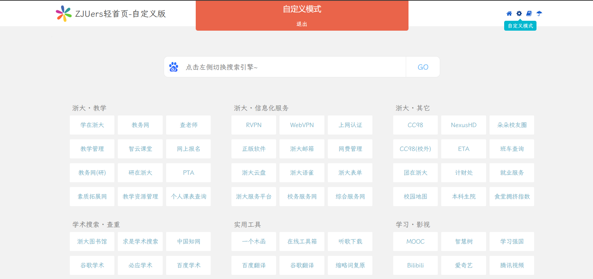
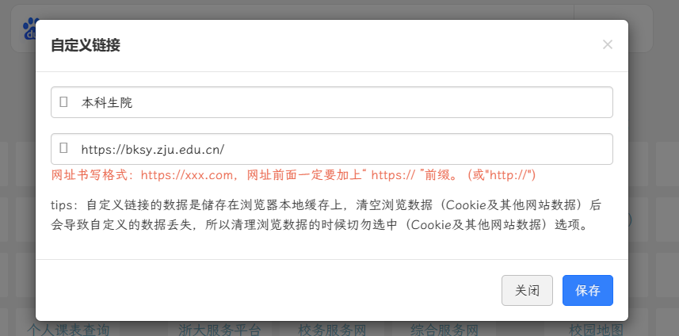
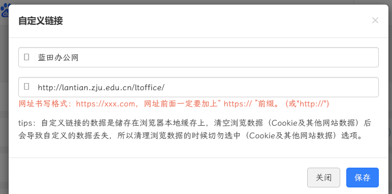
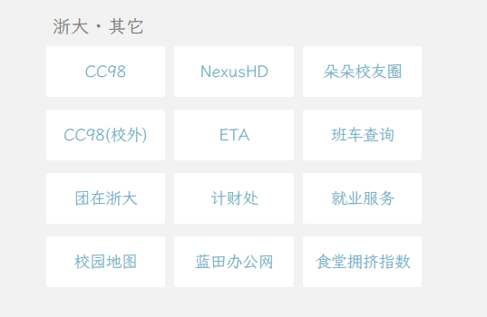
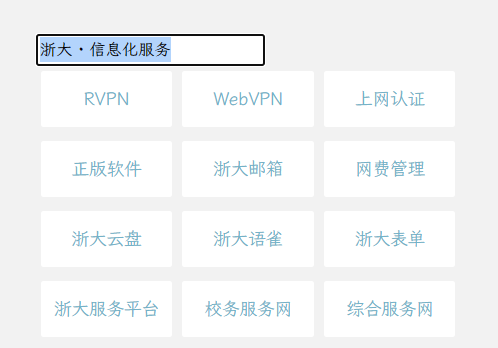
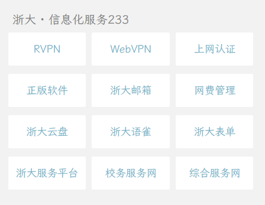
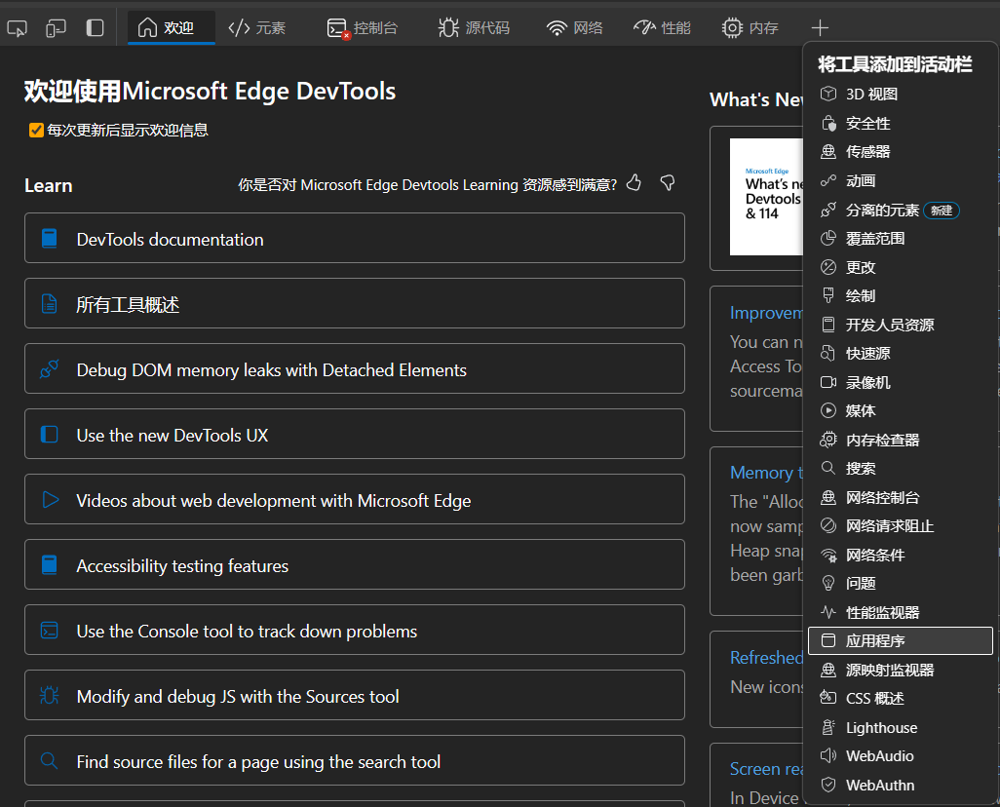
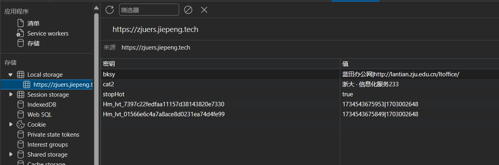

# 网站使用指南

欢迎来到ZJUers轻首页-自定义版！该轻首页是一个可自定义的简洁多领域网址导航。

## 如何自定义记录？

点击右边齿轮可进入自定义设置。

演示中，我们选择右边“浙大·其他”下边的本科生院，会出现如下窗口：

我们将其修改为蓝田办公网：

点击保存，即可看到修改后的效果：

此时，我们点击蓝田办公网，即可跳转到蓝田办公网。而且，浏览器会自动记住你的设置，下次打开该轻首页时，你的设置依然有效。（如果你清除了浏览器缓存，那么你的设置也会被清除）

同时，自定义设置还支持修改小标题，如下图所示：

## 如何还原单个记录？

以 Edge 浏览器为例，我们按下 F12 键，打开开发者工具，选择应用程序：

如果没看到应用程序，那么我们先点击 `+` 号，再选择应用程序：

我们点击其中的 `Local Storage` ，可以看到我们之前修改的记录：

我们可以右键删除某个记录，再刷新页面，即可还原该记录。

## 进入较慢怎么办？

初次打开网页，进入可能会比较慢，这是因为浏览器需要加载一些资源（而且网站是部署在 Github Pages 上的，国内访问速度可能会比较慢）。如果你觉得进入速度太慢，可以尝试使用其他浏览器，或者使用代理。